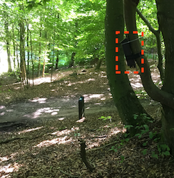

# MTB
A project for recognizing and counting mountain bikers and people walking in the forrest using a small thermal camera.

  ")  

## TODO
This overall todo list is prioritized accoring to what needs to be done first.
1) Contributing to scientific paper writing(deadline 12/5 2017)
2) Capturing and annotating data
3) Bringing the HW and SW of the prototype to a stage where the system can easily be used by non-technical persons
4) Implement improvements to e.g. the detection and tracking
5) Automated data collection by use of e.g. data connection + presentation of data


# Software
The project is primarily written in python, originally some parts were written in c++ but later every component should now be available in python.

## Getting up and running

### Data capture
"thermal capture" for capturing and storing 16 bit 80x60 images at 7 fps to sd card

NB: A few things are out of date and needs to be updated

To start user interface, type:
```bash
startx
```

The capture program is executed from a script that runs when booting up. To enable/disable automatic capture on boot up:

- $ `sudo nano /etc/profile`

comment/uncomment last line “sudo python /home/pi/startupCapture/capture.py

When transferring files, use filezilla. The large number of files cannot be transferred to usb stick or compressed to e.g. .zip

### Data processing

"data processing" for detection and evaluation

Event annotation using [RUBA](https://bitbucket.org/aauvap/ruba/downloads/)

BB annotation using [BBA](https://bitbucket.org/aauvap/bounding-box-annotator/downloads/)


# Hardware
Computer: Raspberry Pi 2

Thermal camera: Lepton LWIR 80 × 60

Power: 10.400mAh
